# Census Data

### Introduction

This module covers an introduction to Census Data. More than other tutorials, this one will teach not as much how to manipulate data once we have it, but how to get it in the first place, followed by some quick operations.

US census data is an amazing effort, and encompasses so much beyond the decennial census effort that we often associate it with. Alongside the decennial census are other products like the American Community Survey (ACS), another data collection effort that conducts in-depth surveys of roughly 1% of the US's population every year, although for the purpose of this tutorial we will refer to both of them as census data.

As a reminder, the 'census data' that we use is really the *summary* of individual responses. We have access to the in-depth data about discrete geographical areas not because everyone that lives there has been surveyed, but rather because the Census Bureau has surveyed a *representative* proportion of the population, and applies *weights* to those responses to come with an estimate for the whole geography. As a quick example, if 5 people out of 20 surveyed in an area make over $x in a calendar year, the Census Bureau will assume that 25% of that area makes over $x in a calendar year (with the caveat that this is drastically oversimplified.)

The data that we will access in this tutorial is a *summary* of those individaul responses. That said, the individual responses themselves, called 'Microdata', are accessible via the Census Bureau's 'Public Use Microdata Sample'. These surveys are stripped of their identifiying charasteristics and only accessible within the PUMA (Public Use Microdata Area) geography, so that they cannot (likely) be used to identify any individuals. The census bureau's [microdata portal](https://data.census.gov/mdat/#/search?ds=ACSPUMS5Y2018) is here, but I also recommend the [iPUMS service](https://www.ipums.org/) from the the University of Minnesota.

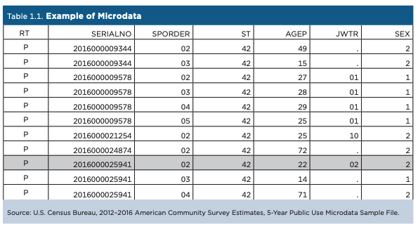

This tutorial is not a comprehensive guide through census data, but rather a quick tour through finding data, and working with it in QGIS. Within it, we will choose datasets that shed light on the difference between sampled and projected population from the most recently available ACS (2023) 5-year estimate. This tutorial is written from the perspective of someone who does not yet know which specific datasets they want to access, and is searching in an exploratory manner.

### Setup

As usual, start a folder for this tutorial with two folders for your data: `original` and `processed`. Open up QGIS, start a new project, and save the project in that folder, so it is at the same level of your two data folders.

### Accessing Census Data

The United States Census Bureau has a data portal named [data.census.gov](https://data.census.gov/), a subdomain of (data.gov)[https://data.gov], the site that the federal government is trying to federal data collection efforts under. Data.census.gov replaced American Fact Finder in 2020, but is still very much a work in progress. In truth, at the time of writing, data.census.gov is wildly overdesigned, and is not particularly adept at finding about statistics about an *area* before mapping it in depth. However, if you already know the general subject that you would like to map and the geography, it is quite good at helping you find the right datasets. 

In this way, you can see that it was designed as a *dataset* exploration tool, and not really one to *explore with data*. For sites that are better for the latter, I recommend [censusreporter](https://censusreporter.org/), [datausa.io](https://datausa.io/) (which is the best tool for exploring microdata), and [social explorer](https://www.socialexplorer.com/) (which is a paid service, but CU students have free access.)

### Performing a Search

There are multiple ways to search on data.census.gov. The first is called `simple search,` the second `advanced search.` In this tutorial we will start with a simple search, and then filter it from there using the advanced search. If you plan on using Census Data more after this, I recommend visiting their guides [here](https://www.census.gov/data/what-is-data-census-gov.html), specifically [this one](https://www.youtube.com/watch?v=QtdmnysIKcQ) on search.

Search for “sample size” in the simple search.

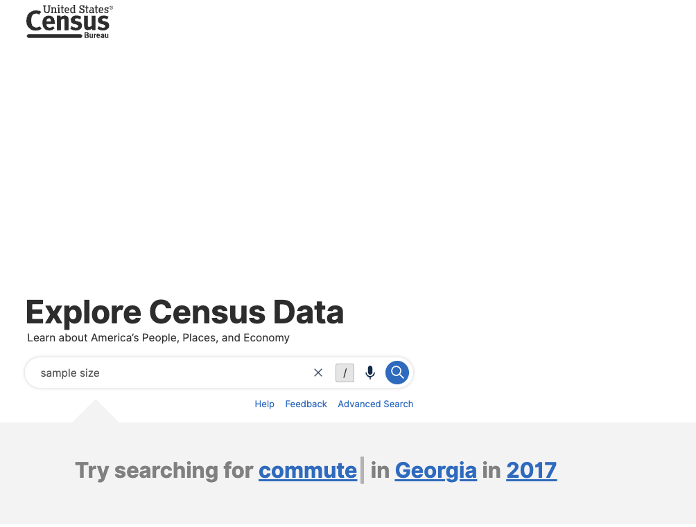

After our search, we see a number of datasets show up:

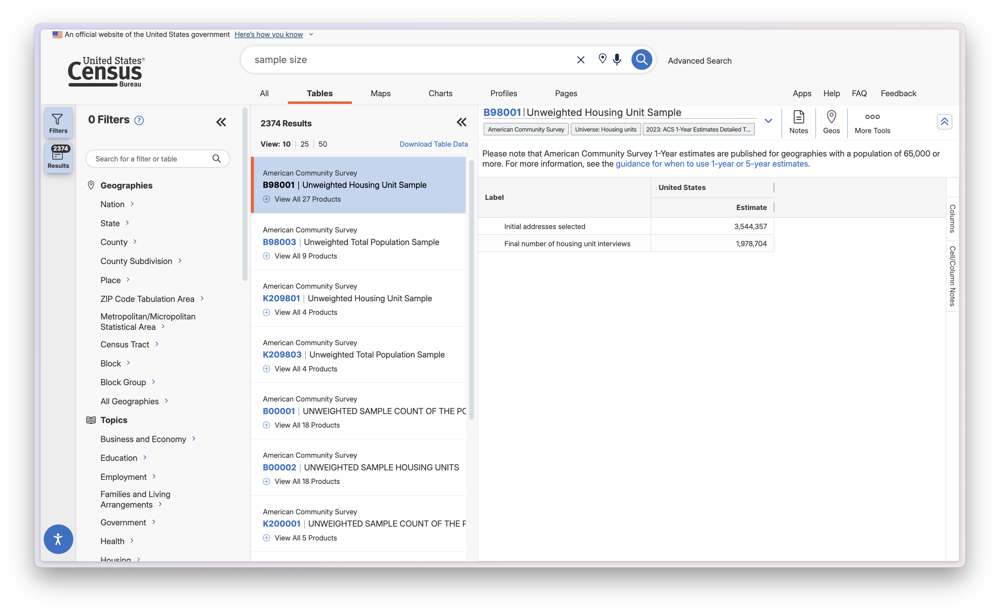

### Looking at a datasets

In the image above, I see `B98001 Unweighted Housing Unit Sample`. I see two labels: Initial addresses selected, and final number of housing unit interivews. A quick search about this data set tells me that the first label is the amount of addresses selected for the survey, and the second is the number of completed surveys. This is a great dataset to use if we are trying to understand the sample size of the census.

### Refining Search to Selected Geographies

One more thing I am noticing is that when I go to `Geos` and select `census tracts`, there are no records. A search tells me that this is because the census bureau restricts the geographies that this dataset is available for to nation, state, county, and place. It seems like this is primarily because of privacy concerns. My original plan was to map this at the census tract level, but it seems like I will have to settle for county.

Click "Geos" on the dataset menu, select `Country`, and select `All Counties within United States and Puerto Rico`. Once you do this, the page will reload, and you will see the geography you selected on the `Filters tab to the left.` Note that there are multiple ways you can do this - you could filter the geographies on the filter bar first instead of through the dataset as well.

Once you have that, click on the `B98001` dataset again. Usually it would display all of the columns and rows, but because it is too large there will be a different message. You can force load it if you wish, but as we are about to download it anyway, it is not necessary.

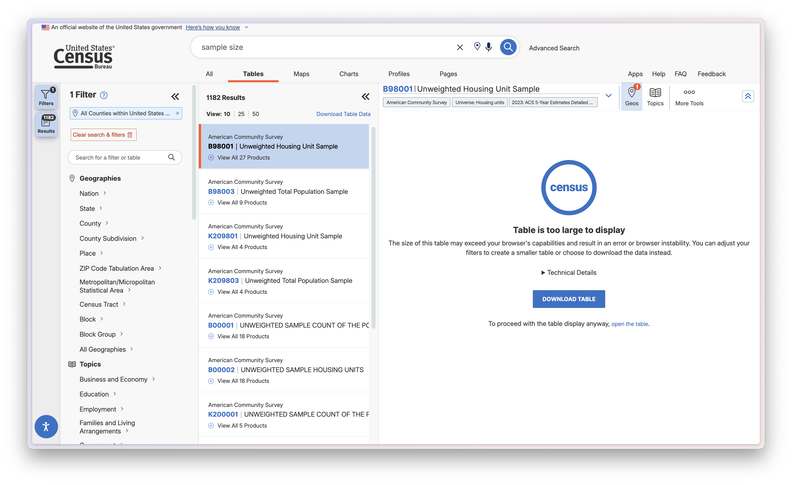

### Downloading the Data, Selecting a Vintage

Make sure your screen looks like mine above (and if it doesn't, make sure that you click the 'B98001' dataset again). Now, click 'Download Table', at the next menu you select which vintage you want to download. Let's do the 2023 ACS 5-year estimates, meaning that the data is from 2019-2023.

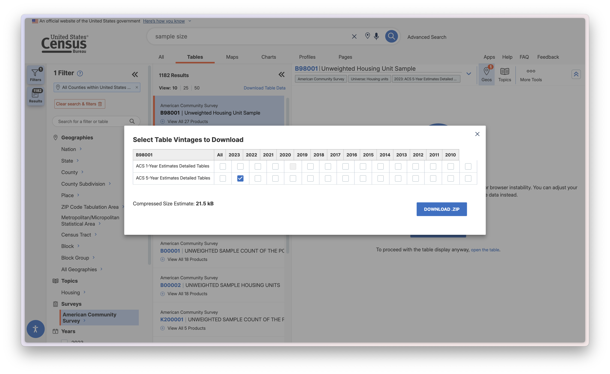

### Downloading a TIGER/line shapefile

Census data is designed to work with shapefiles of administrative geographies. Those geographies are published as TIGER/line shapefiles. Because these districts are subject to political processes, they change, and you always have to pay attention to the year that your data is from matches the year your shapefile is from. There is a lot more standardization after the year 2000 (the whole US wasn't even covered by census tracts until then,) but you will still run into `null` values at times from mismatched years. 

Go to the Census Bureau's [website](https://www.census.gov/geographies/mapping-files/time-series/geo/tiger-line-file.html). Navigate to “Download”, click web interface, or follow this [link](https://www.census.gov/cgi-bin/geo/shapefiles/index.php). Once you are there, select `2023` for year, and `Counties (and equivalent)` for layer type. Download the shapefile, and put it in your `processed` folder.

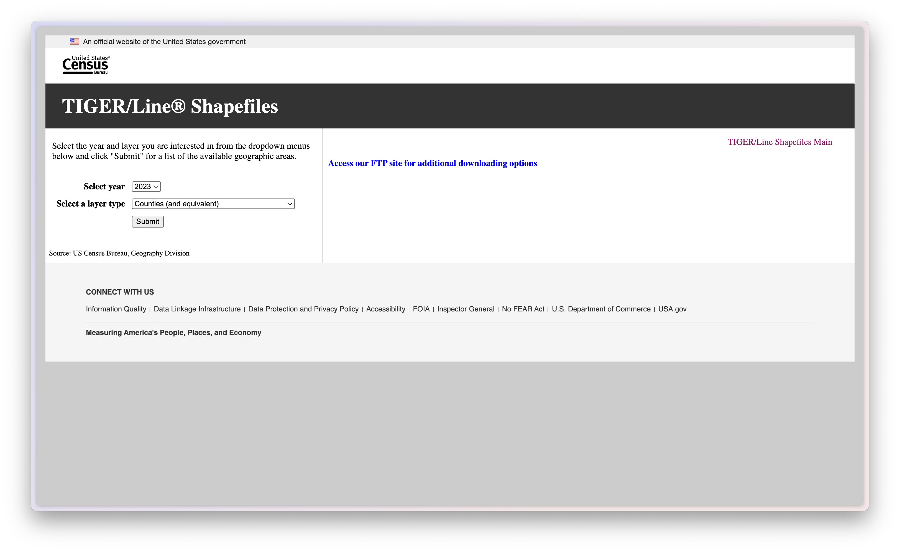

### Importing dataset, specifying datatype

Now let's bring our datasets into QGIS.

Given that we have covered importing both vector and tabular datasets in [Tutorial 1](https://methodsinspatialresearch.xyz/tutorials/1-mapping-where), I will skip those steps here and just mention the important things.

First import your shape file by dragging and dropping, or through `Layer` > `Add layer` > `Add Vector Layer`. Your projection should automatically be set to EPSG: 4269 (NAD83,) but if it is not, set it to that. This is an Albers Equal Area Conic projection that is typically used for continental US mapping.

Next, add the tabular `B98001` census dataset, a .csv of which you have in your `original` data folder. Do not drag and drop this dataset, but rather add it through `Layer` > `Add layer` > `Add Delimited Text Layer`. QGIS tends to make more inferences about the data type of each layer when you drag and drop, and we want to specify one of those columns.

In the resulting window, check the options here. The first row in the dataset is a description of the columns, so in this case we will set `Number of header lines to discard` to 1. This will change the names of the columns to whatever is in the first row, so `GEO_ID` to `Geography`, for exampple. You can leave it too, but you will then have to deal with it later when you go to make your map. I usually discard this row manually in my text editor before adding it, so I can keep the original headers, but for the purpose of this exercise I will not. Next, there is no geometry, so under the `Geometry Definition` section, mark the appropriate option. Make sure that you mark column `B98001_001E` and `B98001_002E` as an `integer`. Either 32 or 64 bit will do in this case, but if it was a number in the tens of millions, you would want it to be 64. You really can't go wrong with 64 ever, although it uses more memory (which does not matter for most cases, but you should keep in mind if you start working with very large dataset and compute becomes an issue.)

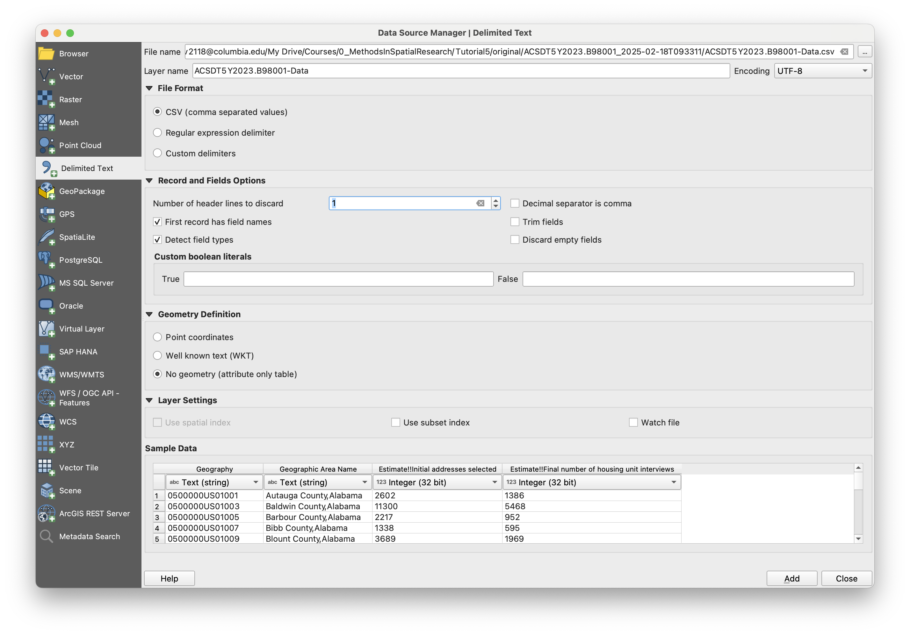

### Performing a vector join

Both datasets are added! Now let's join them to eachother. We have done this before in [Tutorial 1](https://methodsinspatialresearch.xyz/tutorials/1-mapping-where), so I will breifly describe the redundant steps.

As a reminder, you will be joining the tabular dataset **to** the vector dataset. So open up the census tract shapefile by double-clicking on it, browse to `Joins`, and click `Add`.

Here you'll want to join the geographic identifiers together. In the tabular dataset from the census, that dataset is `Geography`, and in the vector dataset, that is `GEOID`. Let's select those two and hit join. 

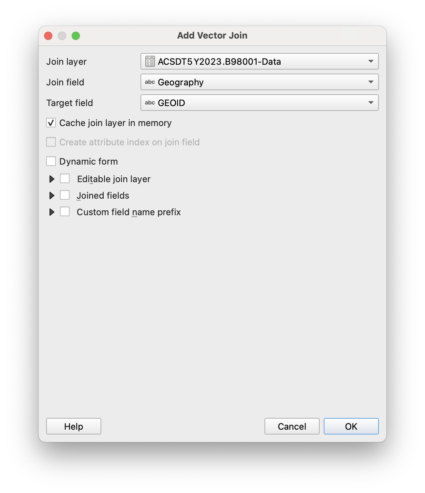

### Troubleshooting

And... it didn't work! If you try to visualize the data with a layer fill - you will not see those fields pop up. What is going on here? 

Let's open up the `attribute table` with a right click on the vector layer that we joined to. We see that two new columns were joined to this dataset, however they all have `null` for a value.

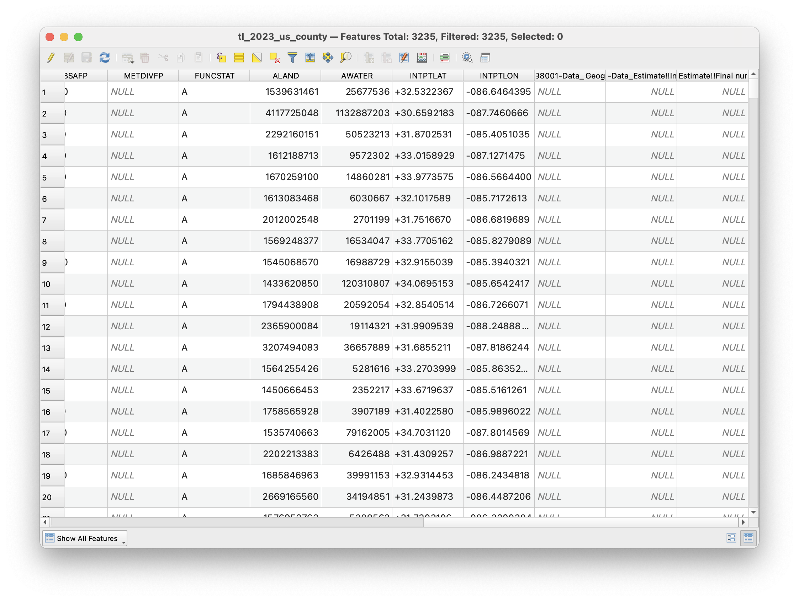

So what happened here? Let's open up both of our attribute tables, and see if we can figure out why the join failed. We see that the `Geography` and `GEOID` fields look pretty different - specifically that the one from the census has a `1400000US` appended to the front of it. However, after that looks to be the exact same. 

You will run into this all the time with census data. The tabular datasets don't have this, but the TIGER shapefiles do. Even with different datasets and different problems, get used to this process of troubleshooting - if something isn't working, look at the original data and try to think as you are asking the computer to.

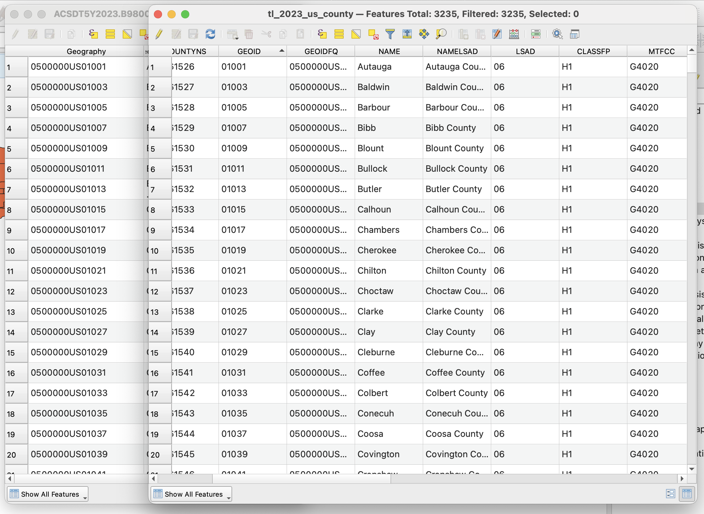

### Adding a new GEOID

We could either take off the `050000US` on the tabular dataset, or add it to the vector. I chose to do the former here, because as it is it is just adding memory that we don't need to use otherwise.

To do that, we should open up the attribute table, and open the field calculator. It has an abacus icon, it says `open field calculator` if you hover over it. There, we create a new field called `GEOID`, so it matches with the vector dataset (but it could be called anything,) and put in the expression field `right(Geography,5)`. What does this mean? `right` is an operation that you can find if you click underneath the `string` category (strings are collections of characters, which are note read as numbers like an `integer` or `double`.) If you read the description there - it says that `right` asks for a string field, and a number to signify how many characters to keep from the right side of a string. Anythign left over it will erase. We put `5` here, because if we look at the field for GEOID in the vector dataset (double click and go to `Fields`,) we see that it is 5 characters long. Please note that the five characters represent the GEOID for a county, and if was a census tract for example, you would have to change this value to make it longer. Altogether, his means that this expression will create a new field called `GEOID`, that contains the string from `Geography` but without the `050000US`. 

Hit OK, it may take a second to complete.

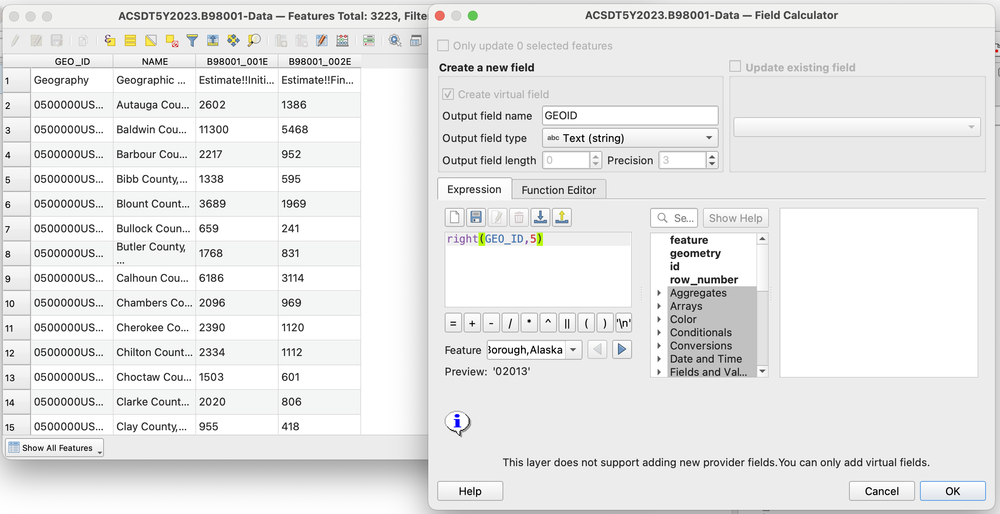

### Mapping the result

Perform the join again by matching the new field `GEOID` from the tabular dataset, with `GEOID` from the vector dataset. After that, let's map the result. I am going to use the `Final Number of housing unit interviews` column. I will skip describing the steps to perform a graduated fill layer on the sample estimate field, but if you need a recap, check out tutorial 1. 

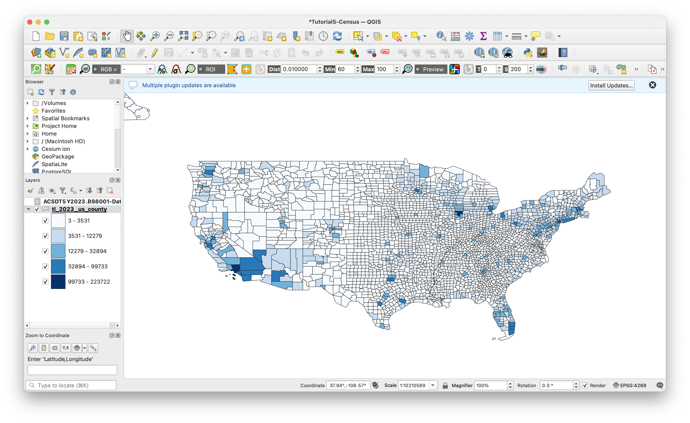

Looking at our map - what do we have? The intervews in each county range from 3 to 223722. Quite a range. Each county has different populations demographics and densities, so on its own this dataset does not tell us much. 

### Selected vs final sample

Let's do one more thing more before we move onto the next step: Let's create a new metric that gives us a percentage of how many interviews were succesful in each county, relative to how many were selected for interviews.

To do that, let's go back to our attribute table for the counties shapefile layer. Let's open up the field calculator again and make our new metric. 

How do you figure that out? Well, we want to get the percentage of the selected households vs the final interveiws. That means our expression should work like Interview Percent = Final Interviews / Selected Households. Let's name this new field `interview%`, and also make sure that we select `decimal-number` for the output field type. 

All we have to put in the expression editor is the division of our two datasets. These names are long and complicated, so lets select them using the `Fields and Values` Dropdown in the center menu. It should look like this before you hit `OK`.

`"ACSDT5Y2023.B98001-Data_Estimate!!Final number of housing unit interviews" / "ACSDT5Y2023.B98001-Data_Estimate!!Initial addresses selected"`

Now, let's map our result. I am going to stick with a blue ramp for now, because a higher percentage of interviews is better. That being said, I don't fully understand the goals of the census bureau here - it actually may be the case that they select a higher amount of households relative to a population if they anticipate difficulty in getting a response. So this metric is definitely telling us differences in how housholds in a geography might be receptive to interviews by the census bureau, but it may not be indicative of data quality.
**However, this might be a good metric to revisit later for the assignment.**

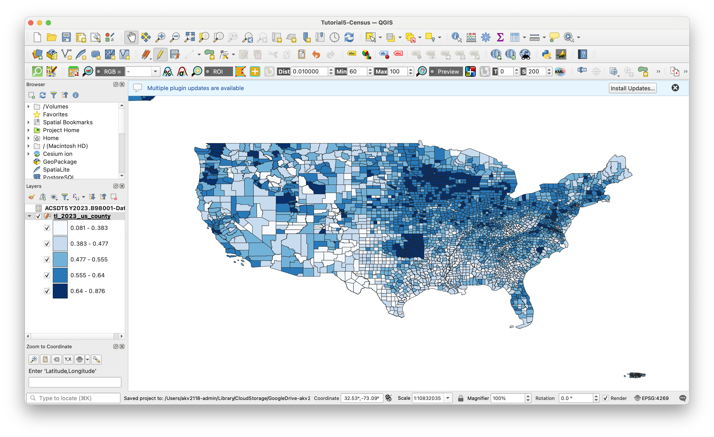

### Getting Another Dataset to Compare

Let's go back to data.census.gov and find a dataset for population. Search for `population` and lets see what comes up. If your geography information isn't saved from your last search, enter those again. 

There are a few results. The first result is from the census, which would work, but it would be ideal if we compared the sample size with population numbers from the 2023 ACS 5-year estimate. The next two datasets, `DP05` and `S01011`, fit that description. In ACS, `S` tables are subject tables, that usually contains multliple fields all around a similar topic, in this case, Age and Sex. `DP` is a data profile, which contains a subset of the most frequently requested datasets around a topic, in this case demographic and housing estimates. 

We only need information on population, so either will do, but I am going to download `DP05`, because it will have additional data that I may want to look at later (or that you may want to use in the assignment). Besides, I am not working with a massive shapefile, so I don't have to worry about the datasets becoming so large that they are hard to use. 

Download the dataset, select ACT 5-year estimates, and select `2023` for the year. Put the folder in your `original` data folder.

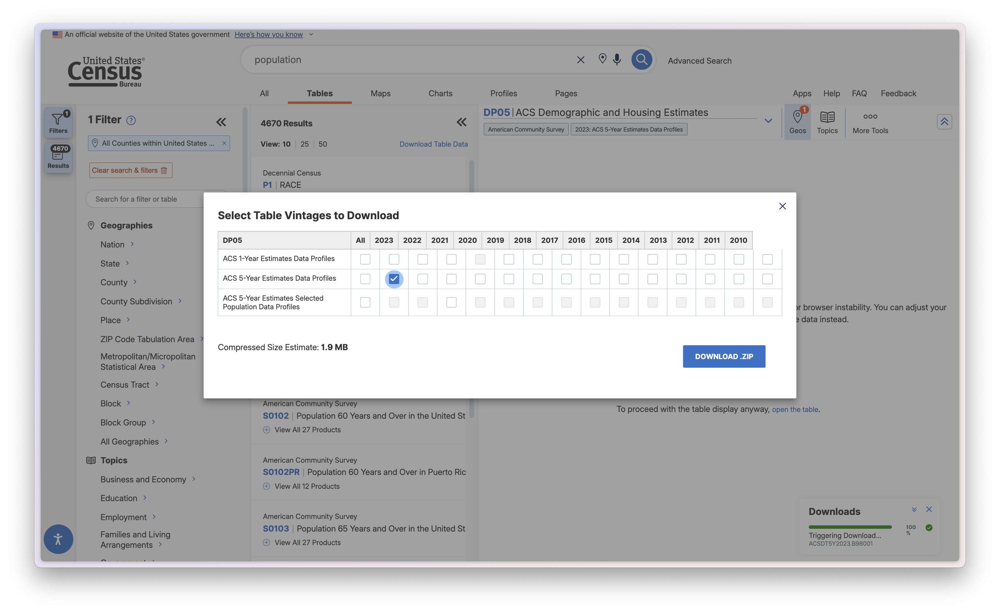

### Adding demographic dataset

Let's add our new csv to the project the same as before. We'll be using very similar import settings to last time.

Also, make sure that the `Total Population` field is set to integer. We're only going to use that one, but now would be a good time to look through some of the other fields and make sure that you're importing any you might like to use with the correct datatype.

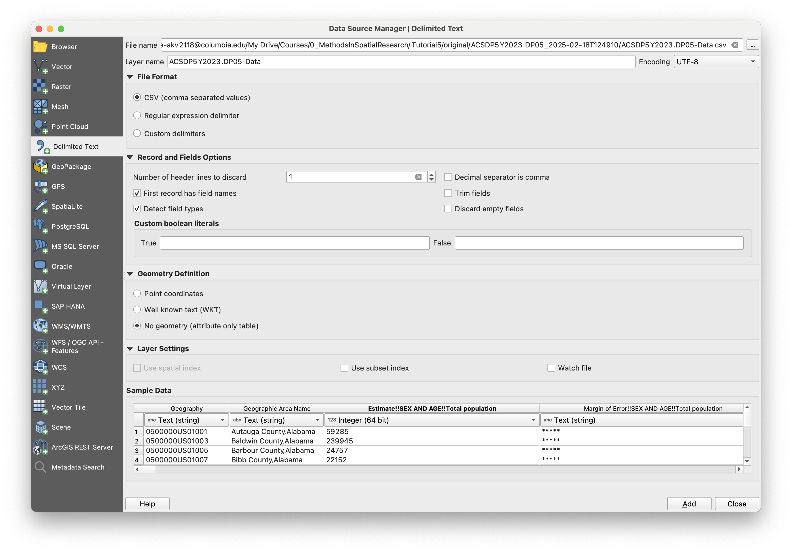

### Making GEO IDS match, Joining to vector dataset

Same as before, let's strip the `050000US` from the beginning of the `Geography` field using the field calculator. I'll name this new field `GEOID`, same as with the last dataset.

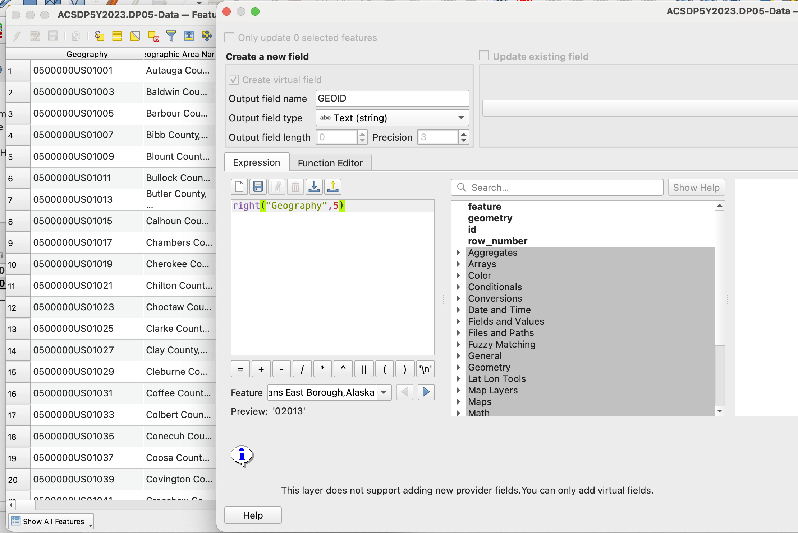

Now that that is done, let's join this dataset to our shapefile - the same one that we have already joined one dataset to. Match the GEOID's as before (you may have to scroll to the bottom of your tabular dataset,) and it may take a few minutes, this is a large dataset.

## Looking at our Joined Data

Now let's open up the attribute table of the joined dataset, and check to make sure everything is ok. There are some null fields, but if I scroll I see that the vast majority are completed. That could be happening for many reasons, that would be worth looking into if we needed a very solid analysis, but for our purposes this is ok. 

Our joined dataset now has many, many fields, and is kind of difficult to read. I recommend click on `Organize Columns` next the field calculator, and positioning the two datasets that we are interested in right next to each other, and after the `GEOID`. You don't have to do this, but I just recommend it both for the next step, and for ease of reading. In the image below, the square around the red fields are the ones I moved up to the front.

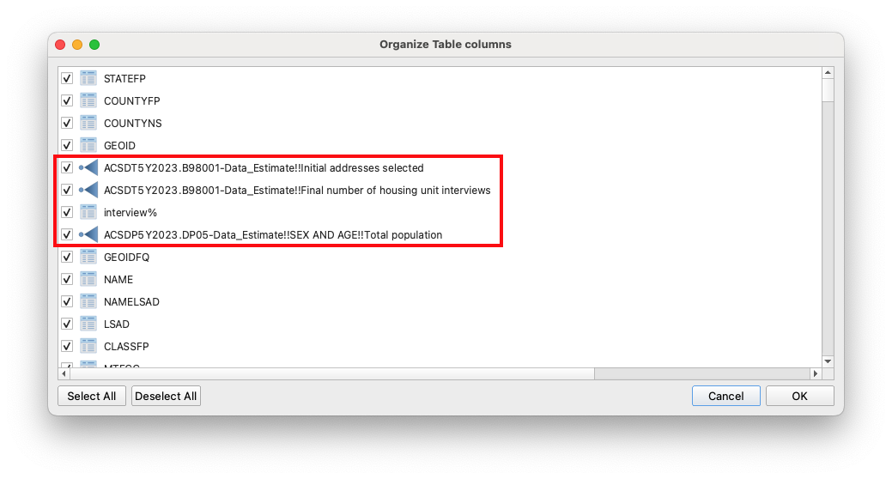
 
Comparing the two datasets - we immediately see that the ratio is not consistent. Looking at the first two rows, the sample size vs actualy population is 12% and 8% respectively. It seems like this might be worthy of looking into a bit more.

### Creating a Sample Percent field

We are really interested in understanding the sample size (final interview count) vs the actual (estimated) population. In order to do that, let's create a new field using the field calculator.

Lets do something similar to what we did before. We want to get the percentage of the sample size vs the final count. That means our expression should work like Sample Percent = Sample Size (final interview count) / Total Population. Let's name this new field `sample%`, and also make sure that we select `decimal-number` for the output field type. 

All we have to put in the expression editor is the division of our two datasets. These names are long and complicated, so lets select them using the `Fields and Values` Dropdown in the center menu. Your expression should look like something like this:

`"ACSDT5Y2023.B98001-Data_Estimate!!Final number of housing unit interviews" / "ACSDP5Y2023.DP05-Data_Estimate!!SEX AND AGE!!Total population" `

After you finish this check out the new field. It worked! By default, QGIS will shuffle it to the back of your attribute table. I recommend moving it after the fields that you divided to make it so it is more accessible in the next step. You can do this with `Organize Columns` in the attribute table like we did two steps ago.

### Styling and exporting our new map

Now, lets visualize our data. Go to `symbology`, select graduated from the drop down and `sample%` from the list of fields. I chose a white to blue gradient, because in this case I do feel a bit confident in saying that a higher percentage is a good thing. Classify the results, I recommend using `Natural Breaks`, aka the Jenks optimization method in statistical circles.

One thing I am noticing is that we have some values above 1 - for a metric reflected sampled population against total, that does not make any sense. What is likely going on here is that we are getting outliers from counties where there are very few people, and of the people that are there, near 100% of them are being sampled. What I am going to do is very simplistic, but from looking at the data I can see that there are very few census tracts above 60%. I am going to increase my number of classes, and Natural Breaks will automatically catch where there is a big jump in values, and I will just simply turn that one off. If we were doing this more properly, we would likely want to delete those rows, or constrain our dataset to counties with more than a certain amount of people (and we could make a graduated map with total population to get a sense of what a good cutoff value would be.)

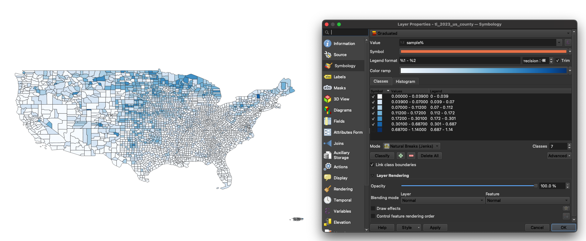

As a side note, if you ever need help picking the right colors for maps in the future, I highly recommmend [Color Brewer 2](https://colorbrewer2.org/#type=sequential&scheme=BuGn&n=3)

Go ahead and export this map to our `processed` folder, with a right click on the layer, Save Features As, and select the location. Filetype up to you, but I prefer geojson. This ensures that your work is portable between QGIS projects, and won't get lost in a crash. 

## Final Map

Looking at our final map, what is it telling us? First of all, it is amazing how relatively small of a sample size the ACS is based off of. That said, the styling of the map is not incredibly useful, as it is overly representative of abnormally high response rates. As mentioned before, making a new sample percentage metric that throws out very low population counties may be useful. 

I see a general trend that urban areas have a lower sample size to final population estimate ratio, whereas rural areas have a higher one. This is a bit counterintuitive to me, as I would expect household in urban areas being easier to reach. But, there could be many things going on here, and between the data we have and the metrics we created, we have a lot of ways to ask more questions.

### Challenge

What other datasets could you add to what we have here to ask more questions, or start to provide answers about what our sample percentage means? Some datasets that could do that our:

- Census response rates 
- Internet Access
- Demographic charateristics
- Housing characteristics (renter/owner, vacant/occupied)

---
Module by Adam Vosburgh, Spring 2025.
